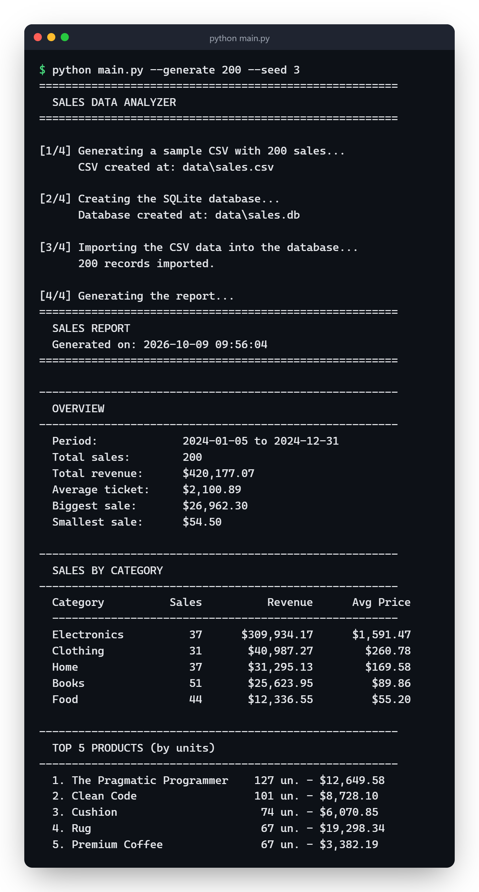
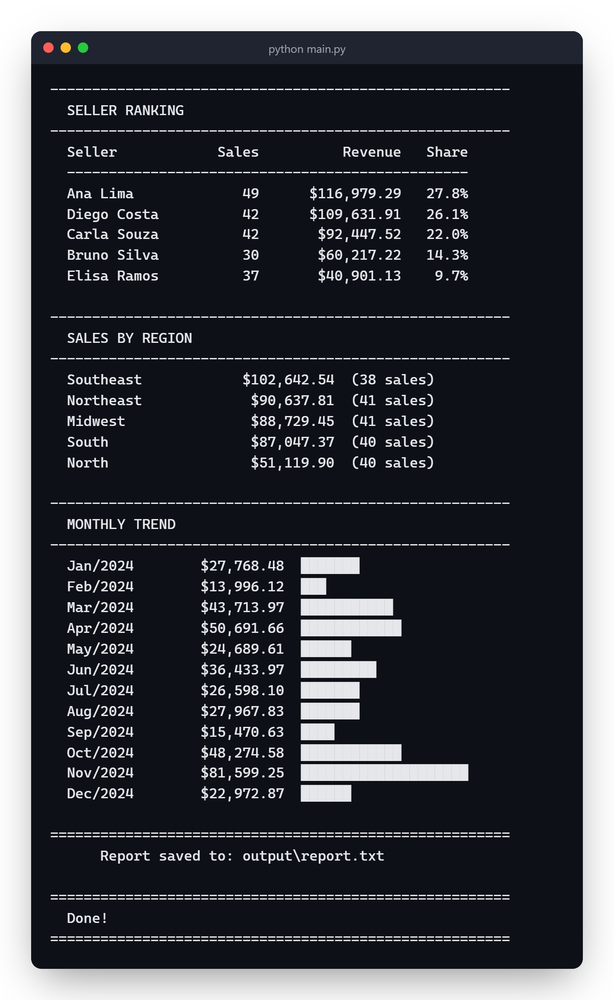
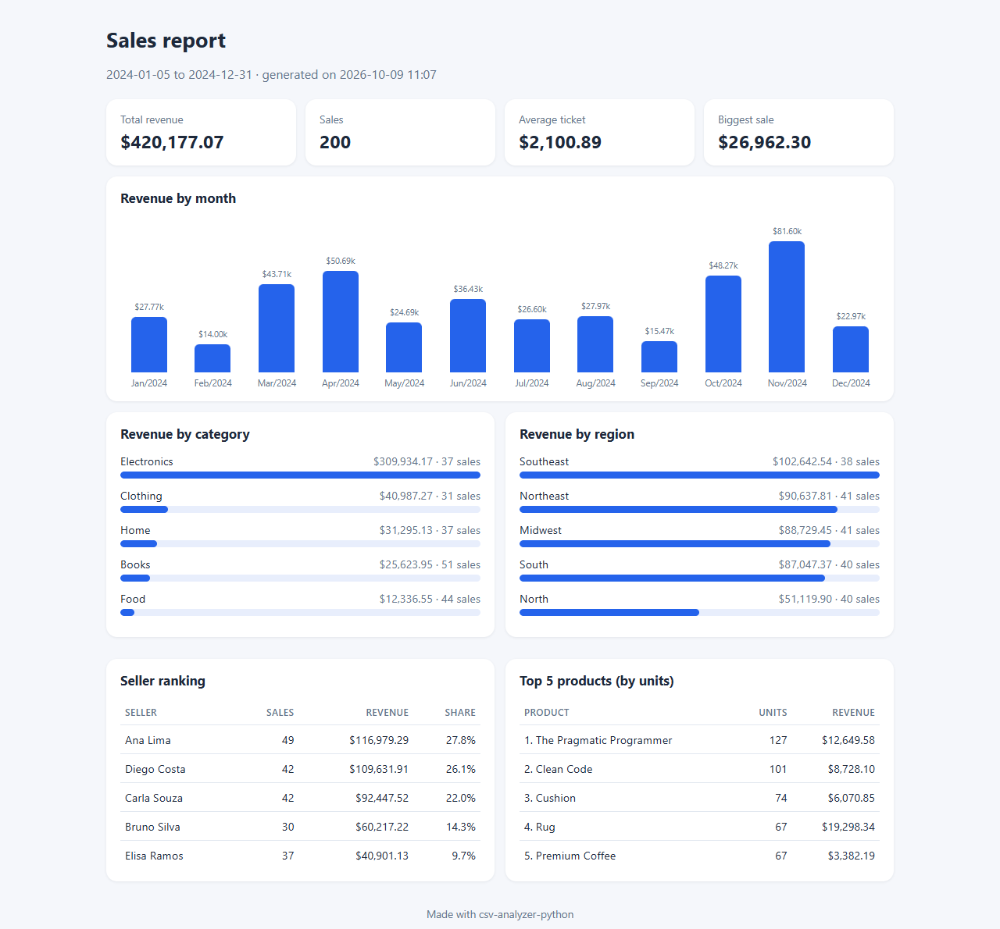

# Sales CSV Analyzer


A Python program that reads a sales CSV, loads the data into a SQLite database and generates a report with the queries written in SQL.

You don't need to install anything besides Python (3.10+).

## Running

```bash
python main.py
```

If there's no CSV at `data/sales.csv`, it generates one with 200 made-up sales. The report goes to `output/report.txt` and also shows up in the terminal.

The report has:
- total revenue and average ticket
- sales by category and by region
- the best-selling products
- the seller ranking
- a simple text chart with the revenue for each month

Options:

```bash
python main.py --csv my_sales.csv          # use another file
python main.py --generate 1000 --seed 42   # generate a new CSV
python main.py --json                      # also save it as JSON
python main.py --html                      # also save a page with charts
```

## What the report looks like

A run with 200 generated sales (`python main.py --generate 200 --seed 3`):

<p>
  
  
</p>

With `--html` the same report also goes to `output/report.html`, a single page with the charts (plain HTML and CSS, no library, so it opens offline). It follows the system's dark mode too.



## CSV format

```
date,product,category,quantity,price,seller,region
2024-03-10,Laptop,Electronics,1,2500.00,Ana Lima,Southeast
```

The date has to be in the `YYYY-MM-DD` format, and the price can be written with a dot or a comma. The separator can be a comma or a semicolon, which is how Excel saves the file in some languages. If a row is wrong, the program skips it and tells you which one and why.

## Tests

```bash
python -m unittest discover -s tests
```

## Files

```
main.py
src/database.py        creates the database and imports the CSV
src/analyzer.py        queries and building the report
src/csv_generator.py   generates the sample data
src/html_report.py     the HTML version of the report
```
